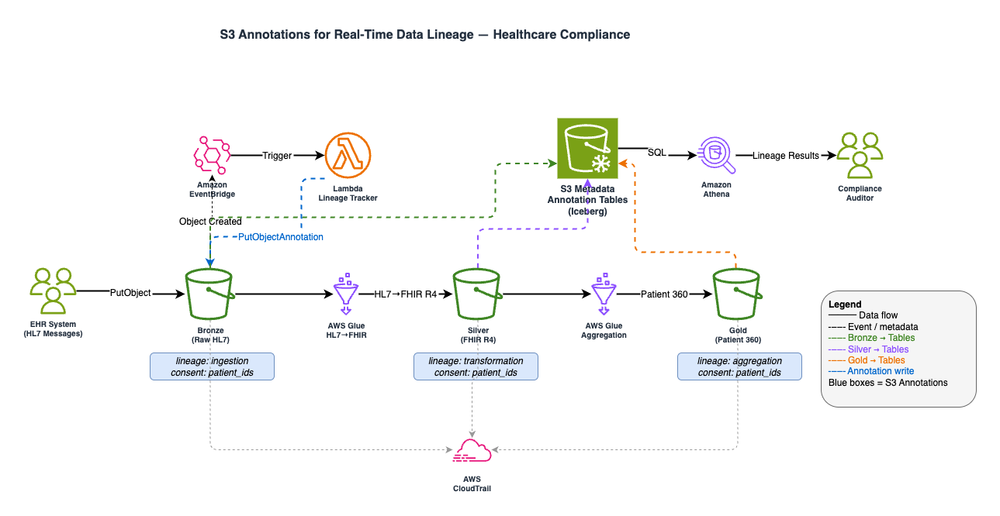

# Tracking healthcare data lineage in real time with Amazon S3 annotations

## Project Overview
Solving the $10B data governance crisis with S3 Annotations - automated, real-time data lineage tracking for healthcare and financial services compliance.

## Problem Statement
- Healthcare/finance orgs have petabytes in S3
- Compliance auditors demand: "Where did this data originate? Who accessed it? What transformations happened?"
- Current answer: Manual spreadsheet archaeology, takes weeks
- Penalties: HIPAA violations $50k-$1.5M, GDPR up to €20M, SOX up to 20 years imprisonment

## Solution
Use S3 Annotations to automatically track data lineage in real-time as data moves through pipelines.

## Architecture



## Project Structure

```
s3-annotations-data-lineage/
├── architecture/          # Architecture diagrams and design docs
├── code/                  # Lambda functions, Glue jobs, utilities
├── docs/                  # Blog draft, research notes
├── infrastructure/        # CloudFormation/CDK for deployment
└── README.md             # This file
```

## Blog Post

> **[S3 Annotations for Real-Time Data Lineage in Healthcare](TODO: insert blog URL)**
>
> This repository contains the companion code for the blog post.

## Key Features

1. **Real-Time Lineage**: Annotations written as data transforms
2. **Queryable**: SQL queries via Athena over annotation tables
3. **Compliance-Ready**: Tracks who/what/when/why for audits
4. **Cost-Effective**: No external lineage database needed, uses native S3 pricing for annotation storage
5. **Scalable**: 1GB metadata per object, handles petabyte-scale data lakes

## Target Use Cases

- **HIPAA Audit**: "Show all transformations on patient_records_2026.parquet"
- **GDPR Right to Erasure**: "Find all objects containing data for user ID 12345"
- **SOX Financial Audit**: "Trace this financial report back to source transactions"

## Tech Stack

- **Storage**: Amazon S3 with Annotations
- **Processing**: AWS Glue, AWS Lambda
- **Querying**: Amazon Athena
- **Orchestration**: Amazon EventBridge
- **Audit**: AWS CloudTrail, Amazon CloudWatch
- **IaC**: AWS CloudFormation

## Deployment

### Prerequisites
- AWS CLI configured with credentials
- Python 3.13+
- Bash shell

### Quick Deploy

```bash
cd infrastructure
./deploy.sh
```

See [infrastructure/README.md](infrastructure/README.md) for detailed deployment instructions.

## Important

This is sample code for demonstration and educational purposes only. It should not be used in production without additional security review. You are responsible for testing, securing, and optimizing this code for production grade use based on your specific quality control practices and standards. Deploying this sample may incur AWS charges for creating or using AWS chargeable resources.

## Security

See [CONTRIBUTING](CONTRIBUTING.md#security-issue-notifications) for more information.

## License

This library is licensed under the MIT-0 License. See the [LICENSE](LICENSE) file.
